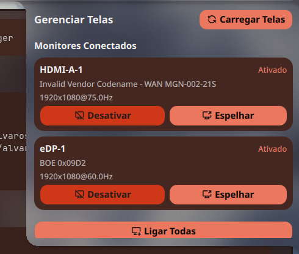

<p align="center">
  
</p>

<h1 align="center">Screen Manager</h1>

<p align="center">
  Plugin para <a href="https://github.com/noctalia-dev/noctalia-qs">Noctalia</a> desenvolvido para o compositor <a href="https://github.com/YaLTeR/niri">Niri</a>
</p>

---

## Sobre

Plugin de gerenciamento de monitores para o **Noctalia** no compositor **Niri**. Permite espelhar, ligar/desligar e gerenciar suas telas diretamente pela barra.

### Funcionalidades

- **Espelhar** — duplica uma tela em outra usando `wl-mirror`
- **Ativar / Desativar** — liga ou desliga monitores individuais (com trava de segurança: não desliga a última tela ativa)
- **Ligar Todas** — liga todos os monitores conectados de uma vez
- **Carregar Telas** — atualiza a lista de monitores detectados
- **Suporte a IPC** — controle tudo via atalhos de teclado

### Requisitos

- [Noctalia](https://github.com/noctalia-dev/noctalia-qs) ≥ 3.6.0
- [Niri](https://github.com/YaLTeR/niri) (compositor Wayland)
- [wl-mirror](https://github.com/Footpad/wl-mirror) (para espelhamento)

### Instalação

#### Via fonte de plugins do Noctalia (recomendado)

1. Abra o **Noctalia** → Configurações → **Plugins**
2. Clique em **Adicionar fonte**
3. Cole a URL: `https://github.com/alvarossantos/screen-manager`
4. O plugin **Screen Manager** aparecerá na lista — clique para instalar
5. Reinicie o Noctalia

#### Via terminal (git clone)

```bash
cd ~/.config/noctalia/plugins
git clone https://github.com/alvarossantos/screen-manager.git screen-manager
```

Reinicie o Noctalia e o plugin aparecerá na lista.

### Comandos IPC

| Comando | Descrição |
|---------|-----------|
| `toggle()` | Abrir/fechar o painel |
| `mirror()` | Espelhar tela secundária na principal |
| `stopMirror()` | Parar espelhamento ativo |
| `disable()` | Desligar a tela secundária |
| `refresh()` | Atualizar lista de monitores |

### Exemplo de atalho (Niri)

```toml
binds {
    Mod+M { spawn "quickshell" "-c" "plugin:screen-manager" "mirror"; }
    Mod+Shift+M { spawn "quickshell" "-c" "plugin:screen-manager" "stopMirror"; }
}
```

### Traduções

| Idioma | Status |
|--------|--------|
| Português (pt) | Completo |
| English (en) | Completo |

Para adicionar um novo idioma, crie um arquivo em `i18n/<código>.json` seguindo a estrutura do `en.json`.

### Licença

MIT

---
---

<p align="center">
  
</p>

<h1 align="center">Screen Manager</h1>

<p align="center">
  Plugin for <a href="https://github.com/noctalia-dev/noctalia-qs">Noctalia</a> built for the <a href="https://github.com/YaLTeR/niri">Niri</a> compositor
</p>

---

## About

Monitor management plugin for **Noctalia** on the **Niri** Wayland compositor. Mirror, enable/disable, and manage your displays directly from the bar.

### Features

- **Mirror** — duplicate one screen onto another using `wl-mirror`
- **Enable / Disable** — turn individual outputs on or off (with safety lock: cannot disable the last active screen)
- **Enable All** — turn on every connected display at once
- **Load Screens** — refresh the list of detected monitors
- **IPC support** — control everything via keybindings

### Requirements

- [Noctalia](https://github.com/noctalia-dev/noctalia-qs) ≥ 3.6.0
- [Niri](https://github.com/YaLTeR/niri) (Wayland compositor)
- [wl-mirror](https://github.com/Footpad/wl-mirror) (for mirroring)

### Installation

#### Via Noctalia plugin source (recommended)

1. Open **Noctalia** → Settings → **Plugins**
2. Click **Add source**
3. Paste the URL: `https://github.com/alvarossantos/screen-manager`
4. The **Screen Manager** plugin will appear in the list — click to install
5. Restart Noctalia

#### Via terminal (git clone)

```bash
cd ~/.config/noctalia/plugins
git clone https://github.com/alvarossantos/screen-manager.git screen-manager
```

Restart Noctalia and the plugin will appear in the plugin list.

### IPC Commands

| Command | Description |
|---------|-------------|
| `toggle()` | Open/close the panel |
| `mirror()` | Mirror secondary screen onto primary |
| `stopMirror()` | Stop active mirroring |
| `disable()` | Disable the secondary output |
| `refresh()` | Refresh output list |

### Example keybinding (Niri)

```toml
binds {
    Mod+M { spawn "quickshell" "-c" "plugin:screen-manager" "mirror"; }
    Mod+Shift+M { spawn "quickshell" "-c" "plugin:screen-manager" "stopMirror"; }
}
```

### Translations

| Language | Status |
|----------|--------|
| Português (pt) | Complete |
| English (en) | Complete |

To add a new language, create a file in `i18n/<code>.json` following the structure of `en.json`.

### License

MIT
